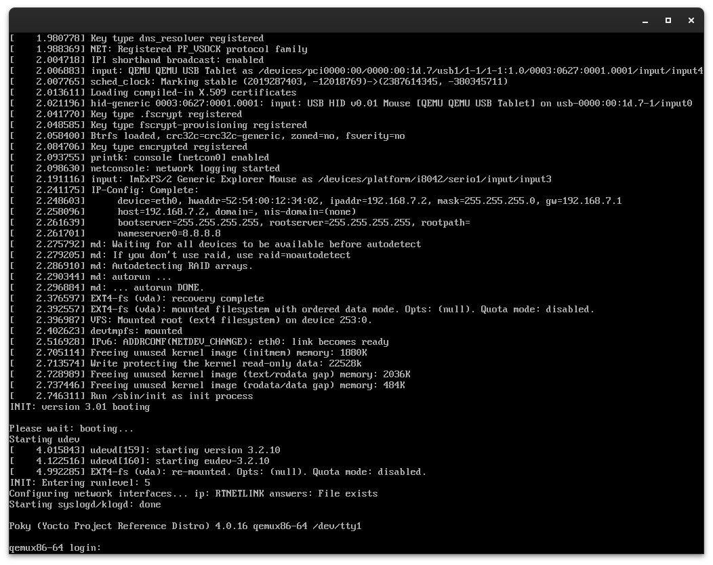

## Первое задание

***Здесь будет пример сборки для Ubuntu Linux. Для других дистибутивов названия некотрых пакетов и утилит могут отличаться***

Для того, чтобы собрать "core-image-minimal", нужно:

1. Установить необходимые зависимости  
    - Выполняем данные команды
    ```bash
    sudo apt install gawk wget git diffstat unzip texinfo gcc build-essential chrpath socat cpio python3 python3-pip python3-pexpect xz-utils debianutils iputils-ping python3-git python3-jinja2 libegl1-mesa libsdl1.2-dev python3-subunit mesa-common-dev zstd liblz4-tool file locales libacl1
    sudo locale-gen en_US.UTF-8
    ```
2. Скопировать репозиторий дистрибутива poky
    ```bash
    git clone -b kirkstone git://git.yoctoproject.org/poky
    ```
    - Здесь мы используем опцию -b для того, чтобы указать, с какой веткой мы хотим работать.
    Выбираем версию Kirkstone.
3. Инициализировать среду сборки.
    - Делается это с помощью команды
    ```bash
    source oe-init-build-env
    ```
    - Мы инициализируем среду сборки и создаем каталог build, в который автоматически перемещаемся.
4. Выполнить сборку образа ОС
    - Перед тем, как сделать это, мы можем проверить и изменить конфигурационные файлы, такие как
    local.conf и bblayers.conf  
    - Затем выполняем команду
    ```bash
    bitbake core-image-minimal
    ```

После успешной сборки образа переходим в директорию ```/poky/build/tmp/deploy/images/``` 
и выполняем команду 
```bash
runqemu qemux86-64
```
Получаем такой результат:


