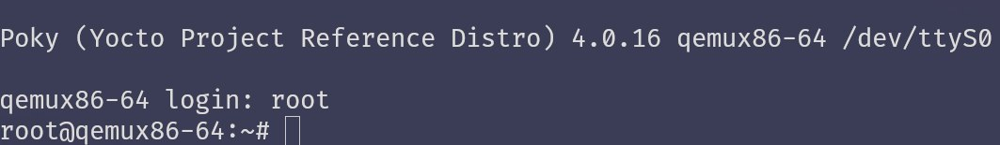

## Второе задание

Для того, чтобы повторить действия, проделанные в первом пункте, но в контейнере docker, \
нужно собрать необходимый образ

Вот пример Dockerfile:
```Dockerfile
FROM ubuntu:focal
ENV TZ=Europe/Moscow
RUN ln -snf /usr/share/zoneinfo/$TZ /etc/localtime && echo $TZ > /etc/timezone

RUN apt-get update && apt-get install -y gawk wget git diffstat \
    unzip texinfo gcc build-essential chrpath socat cpio python3 \
    python3-pip python3-pexpect xz-utils debianutils iputils-ping \
    python3-git python3-jinja2 libegl1-mesa libsdl1.2-dev python3-subunit \
    mesa-common-dev zstd liblz4-tool file locales libacl1 vim \
    qemu-system-x86 iproute2 sudo
RUN locale-gen en_US.UTF-8

ENV LANG en_US.UTF-8
ENV LC_ALL en_US.UTF-8

RUN groupadd -g 1000 yocto && useradd -u 1000 -g yocto -m yocto
RUN echo 'yocto:yocto' | chpasswd
RUN usermod -aG sudo yocto

USER yocto

CMD /bin/bash
```

Затем необходимо собрать образ:

```bash
docker build -t yocto-image .
```

Далее запускаем контейнер:
```bash
docker run -it --privileged -v $(pwd):/workdir --name yocto-con yocto-image
```

После запуска контейнера:
```bash
git clone -b kirkstone git://git.yoctoproject.org/poky
cd poky
source oe-init-build-env
bitbake core-image-minimal
```

***Данные действия можно выполнять в контейнере при помощи команды*** ```docker exec```

Затем после успешной сборки выполняем следующее:
```bash
cd tmp/deploy/images/
runqemu qemux86-64/ slirp nographic
```

В результате получим следующее:


