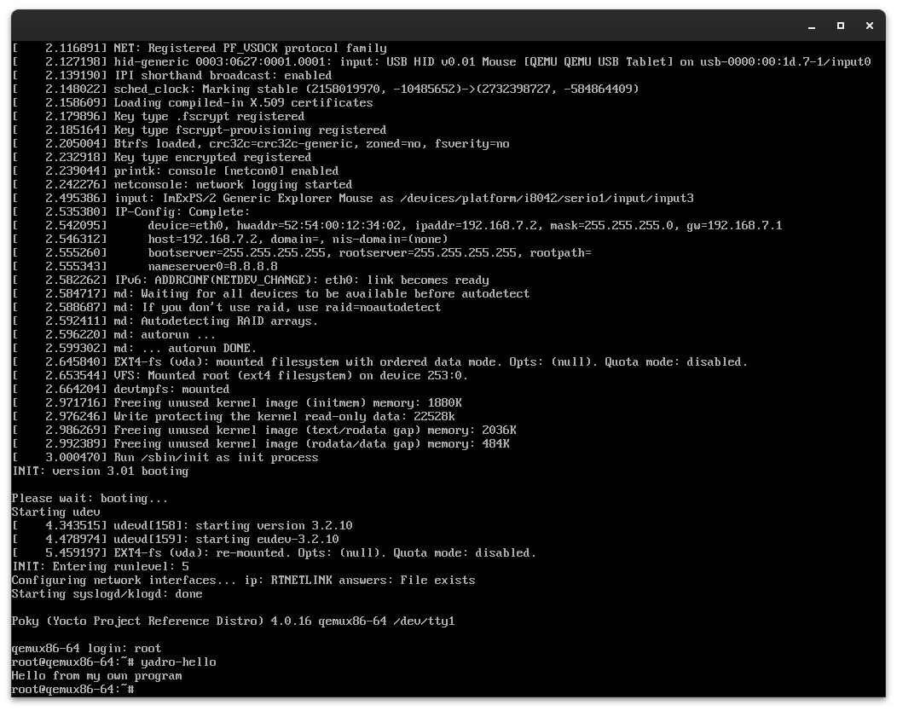

## Третье задание

Для того, чтобы добавить слой в сборку ОС, мы должны сделать следующее:

1. Если мы находимся в директории ```/poky/build```, выполняем следующую команду:
    ```bash
    bitbake-layers create-layer ../meta-mylayer
    ```
    - В директории ```poky``` появится каталог ```meta-mylayer```, в нем будут находиться конфигурационные файлы для
    слоя и "рецепты" сборки.
2. Также нам необходимо добавить наш слой в файл ```bblayers.conf```. Мы можем сделать это при помощи
    команды 
    ```bash
    bitbake-layers add-layer ../meta-mylayer
    ```
3. Добавим нашу программу в слой
    - Создадим программу yadro-hello.c на языке C, которая будет выводить в поток стандартного вывода 
    "Hello from my own program"
    - Создадим директорию ```poky/meta-mylayer/recipes-example/yadro-hello/```. В ней также создадим
    директорию ```files```, куда поместим нашу программу. В ```poky/meta-mylayer/recipes-example/yadro-hello```
    создадим файл ```yadro-hello.bb```
    ```
    SUMMARY = "yadro-hello program"
    LICENSE = "MIT"
    LIC_FILES_CHKSUM = "file://${COREBASE}/meta/COPYING.MIT;md5=3da9cfbcb788c80a0384361b4de20420"
    SRC_URI = "file://yadro-hello.c"

    S = "${WORKDIR}/build"

    do_compile() {
        ${CC} ${CFLAGS} ${LDFLAGS} ${WORKDIR}/yadro-hello.c -o ${C}/yadro-hello
    }

    do_install() {
        install -d ${D}${bindir}
        install -m 0755 ${S}/yadro-hello ${D}${bindir}
    }
    ```
    - Затем добавим в файл ```poky/build/conf/local.conf``` следующую строку:
    ```
    IMAGE_INSTALL:append = " yadro-hello"
    ```
4. Затем пересоберем образ
    ```bash
    bitbake core-image-minimal
    ```
5. Запустим образ в qemu
    ```bash
    cd tmp/deploy/images/
    runqemu qemux86-64
    ```
    - Когда мы запустим qemu, то введем ```yadro-hello``` 

Получим следующий результат:

